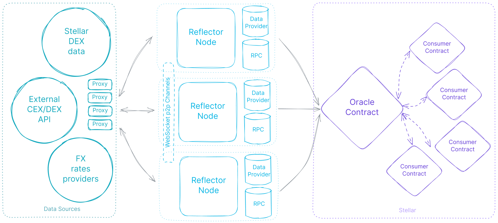

# Vibe Coding with Reflector

Build something new with decentralized price data, or connect Reflector to the Stellar application you already have.

This guide helps you give your coding agent the right context, choose an integration, and check the result. Use it with Cursor, Claude Code, Codex, or another coding agent.

**[Read the guide →](reflector-vibe-coding-guide.md)** · [Get the Reflector Agent Skill](https://github.com/Bran18/reflector-skill) · [Reflector docs](https://reflector.network/docs)

## What is Reflector?

[Reflector](https://reflector.network) is a decentralized price oracle for Stellar. It makes price observations available to applications and smart contracts, enabling features such as portfolio valuation, collateral health checks, historical price charts, and price alerts.

Oracle contracts expose price data through [SEP-40](https://github.com/stellar/stellar-protocol/blob/master/ecosystem/sep-0040.md), Stellar's oracle interface standard. Your application chooses a feed and reads its published observations.

## How it works



*Reflector architecture diagram. See [How it works](https://reflector.network/docs/how-it-works) and the [official contract overview](https://github.com/reflector-network/reflector-contract#how-it-works) for the protocol description.*

1. **Collect data.** Reflector nodes obtain market data from sources such as Stellar trading activity, external exchanges, and foreign-exchange providers.
2. **Agree on updates.** Nodes independently calculate observations and coordinate signed updates through peer-to-peer consensus.
3. **Publish on Stellar.** Agreed updates are written into an oracle contract.
4. **Read in your application.** Consumer contracts and applications retrieve the published data for their own logic.

**A price read retrieves stored oracle data. It does not trigger a new exchange quote.** Check the observation timestamp before using it. The [contract documentation](https://github.com/reflector-network/reflector-contract#how-it-works) describes this flow and its freshness requirements.

## Which Reflector product do I need?

| Product | Start here when you need… | Integration consideration |
|---|---|---|
| **Pulse** | Public on-chain prices for a dashboard or contract | Public feeds use a five-minute update interval. Check feed availability and retention. |
| **Beam** | Flexible feeds or faster updates | Verify the target deployment, caller authorization, and paid-access requirements. |
| **Flare** | Off-chain notifications for supported price conditions or heartbeat updates | Configure a subscription and callback, then handle delivery and subscription lifecycle. |

Pulse reads are free at the oracle level; that does not make every transaction in your application free. The JS client provides simulated reads, and paid or state-changing operations have separate requirements. See the [official client documentation](https://github.com/reflector-network/contract-client-js) for client setup and access behavior.

You do not need to run a Reflector node to consume a feed. Start with the integration that fits your application and let the skill guide the implementation details.

## Start building

### 1. Give your agent the skill

Run this from your project directory with Node.js and npm available:

```bash
npx skills add Bran18/reflector-skill
```

Follow the installer prompts to select your agent and the `reflector` skill. The [skill repository](https://github.com/Bran18/reflector-skill) includes architecture, deployments, JavaScript clients, Rust consumer contracts, Flare, and DeFi integration patterns. Installation uses the [Skills CLI](https://github.com/vercel-labs/skills#install-a-skill).

### 2. Describe your application

```text
Use the Reflector skill to help me [build a new application / integrate
with my existing application].

Stack: [framework and language].
Network: [testnet or mainnet].
Feature: [what the application should do].
Assets and desired price denomination: [values].

Inspect the project first. Identify the appropriate Reflector product,
feed, and exact asset keys. Verify deployment addresses and API signatures.
Explain the integration, then implement a small working version.

Handle decimals, timestamps, stale quotes, and unavailable data explicitly.
Do not invent contract addresses or APIs. Report the checks you ran and
whether the live integration was tested.
```

### 3. Follow a build path

| I want to… | Guide section |
|---|---|
| Add a current price to a TypeScript app | [Read a price](reflector-vibe-coding-guide.md#read-a-price) |
| Read oracle data in a Soroban contract | [Consume a price in a Soroban contract](reflector-vibe-coding-guide.md#consume-a-price-in-a-soroban-contract) |
| Evaluate collateral health | [Calculate a liquidation health check](reflector-vibe-coding-guide.md#calculate-a-liquidation-health-check) |
| Calculate asset allocations and proposed adjustments | [Build a portfolio rebalancing example](reflector-vibe-coding-guide.md#build-a-portfolio-rebalancing-example) |
| Work with past observations | [Use historical prices](reflector-vibe-coding-guide.md#use-historical-prices) |
| React to supported price conditions | [React to a price condition with Flare](reflector-vibe-coding-guide.md#react-to-a-price-condition-with-flare) |

Already have an app? Start with [Wiring up an existing application](reflector-vibe-coding-guide.md#wiring-up-an-existing-application) to integrate at the existing price-data boundary.

## Before using a quote

Confirm the network, oracle, exact asset identifier, and base denomination. Read price precision from `decimals()`, validate timestamps, and handle missing data explicitly. A plausible number is not proof that the correct feed was selected.

For financial operations, also test units, rounding, overflow, risk thresholds, and failure behavior. Use the guide's [review checklist](reflector-vibe-coding-guide.md#5-dont-blindly-accept-generated-code) before shipping.

## Useful links

### Official Reflector resources

| Resource | What you'll find |
|---|---|
| [Documentation](https://reflector.network/docs) | Product and integration documentation |
| [How it works](https://reflector.network/docs/how-it-works) | Architecture and data flow |
| [Contract interface](https://reflector.network/docs/interface) | Oracle methods and data types |
| [Pulse feeds](https://reflector.network/pulse) | Public feed discovery and deployment information |
| [Examples](https://reflector.network/docs/examples) | Application and DeFi integration patterns |
| [JavaScript client](https://github.com/reflector-network/contract-client-js) | Client setup, read methods, and write operations |
| [Oracle contracts](https://github.com/reflector-network/reflector-contract) | Rust interfaces and contract implementation |
| [Reflector nodes](https://github.com/reflector-network/reflector-node) | Node implementation for operators and architecture research |

### Standards and community tools

- [SEP-40](https://github.com/stellar/stellar-protocol/blob/master/ecosystem/sep-0040.md): the Stellar oracle consumer interface.
- [Stellar oracle providers](https://developers.stellar.org/docs/data/oracles/oracle-providers): Stellar's oracle integration resources.
- [Reflector Agent Skill](https://github.com/Bran18/reflector-skill): context and procedural guidance for coding agents.
- [Reflector Market Board](https://github.com/Bran18/reflector-market-board): a reference app linked by the skill.

## Contributing

Found an unclear prompt, outdated reference, or useful integration example? Open an issue or pull request. Include official sources for technical corrections and distinguish mocked tests from live network checks. Keep credentials out of examples.

This repository is a community guide, not official Reflector documentation. The Markdown guide is available now; a documentation website has not been deployed.
