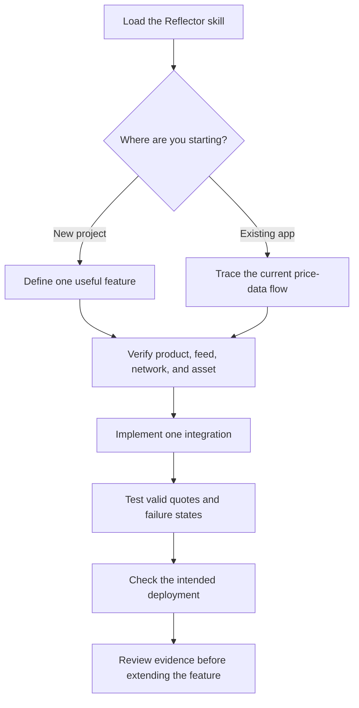
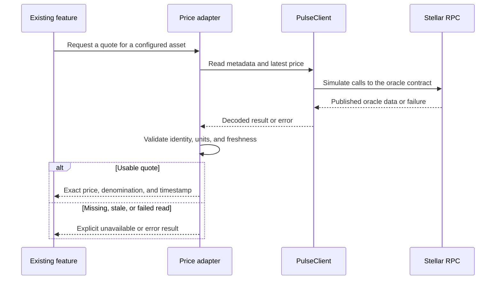
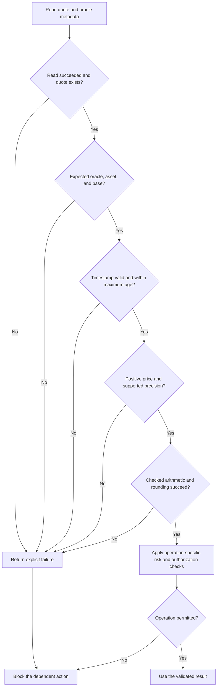

# Vibe Coding with Reflector

Building a Stellar application with Cursor, Claude Code, Codex, or another coding agent?

This guide shows you how to give your agent the right Reflector context and build applications using decentralized price data. Start a new project or wire Reflector into an application you already have.

## 1. Give your agent Reflector context

The [Reflector Agent Skill](https://github.com/Bran18/reflector-skill) gives your coding agent integration instructions and references for:

- Pulse and Beam architecture and product selection.
- Oracle deployments and network-specific asset identifiers.
- TypeScript and JavaScript with `@reflector/contract-client`.
- Rust consumer contracts and SEP-40 interfaces.
- Flare price subscriptions and alerts.
- Integration patterns and DeFi examples, including liquidation checks, historical pricing, and portfolio rebalancing.

### Install the skill

With Node.js and npm available, run this from your project directory:

```bash
npx skills add Bran18/reflector-skill
```

Follow the installer prompts to select your coding agent and the `reflector` skill. To inspect available skills before installing:

```bash
npx skills add Bran18/reflector-skill --list
```

The command uses the GitHub source format documented by the [Skills CLI](https://github.com/vercel-labs/skills#install-a-skill). The repository contains the skill at [skills/reflector/SKILL.md](https://github.com/Bran18/reflector-skill/blob/main/skills/reflector/SKILL.md), alongside its reference files.

Then ask your agent:

```text
Find and read the installed Reflector skill. Tell me which skill file you
loaded and which references apply to this project. If you cannot find it,
say so before implementing the integration.
```

If your environment does not support the installer, provide the agent with the repository's `skills/reflector/` directory, including `references/`, and ask it to read `SKILL.md` first.

The skill provides context; your prompt defines the application. Ask the agent to verify deployment addresses and API signatures against current official sources and the versions used in your project.

## 2. Tell the agent what you're building

Start with the outcome you want and enough context to choose the right integration. Replace bracketed values before sending a prompt.



Both paths meet at the same checkpoint: establish which data the feature needs before generating integration code.

### Building something new

```text
I'm building a Stellar application that needs XLM price data.

Use the Reflector skill for the integration.
Stack: [TypeScript script / Next.js / Rust and Soroban].
Network: [testnet / mainnet].
Price source: [Stellar pubnet market / Stellar testnet market / help me choose].
Price denomination: [USD / USDC / help me choose].
Goal: [describe what someone should be able to do].

Before writing code:
1. Identify the appropriate Reflector product, oracle, and exact asset key.
2. Explain which interface we'll use and why.
3. Identify the required dependencies and configuration.
4. Explain how decimals, timestamps, and unavailable prices will be handled.

Then implement the smallest working version with setup instructions.
Do not invent contract addresses or Reflector APIs. Use the skill's
references and confirm deployment details against official sources.
Run the relevant checks and distinguish live results from mocked results.
```

### Wiring up an existing application

Keep the Reflector-specific calls in an adapter so the rest of the feature receives a consistent result: a validated quote or an explicit failure. This diagram shows an off-chain application; a Soroban consumer invokes the oracle on-chain instead of using the JavaScript client.



The feature owns the response to a failure: a UI can display an unavailable state, while a dependent financial action must stop. Reading through RPC does not cause Reflector nodes to publish a new observation.

```text
I already have a Stellar application. Wire Reflector into its existing
price-data flow using the Reflector skill.

Feature: [portfolio view / collateral valuation / price chart / other].
Current price source: [mock data / API / existing oracle / none].
Relevant files: [paths, or ask the agent to locate them].
Network: [testnet / mainnet].
Assets and desired denomination: [values].

Inspect the project and trace how prices reach this feature. Identify the
best integration point and explain the changes before implementing them.
Reuse the existing stack, component conventions, and configuration system.
Preserve unrelated behavior and identify any units or return types that
must change.

Replace the selected price source with a Reflector adapter. Include the
quote timestamp, asset identity, and base denomination in its result.
Handle stale or missing quotes explicitly. Do not silently substitute
mock data or a different provider when Reflector is unavailable.

Update the relevant tests and setup instructions. Show what changed,
how to run it, and which checks actually passed.
```

**Why ask about the source as well as the network?** An oracle deployed on testnet can report prices from the pubnet market. “XLM on testnet” does not fully specify the desired feed. Have the agent confirm the exact asset using `assets()` and the denomination using `base()`.

## 3. Pick what you're building

Choose a prompt below and add your stack, network, assets, and required behavior. Each example should produce a small feature you can inspect and run.

### Read a price

```text
Add the latest XLM price from Reflector to my TypeScript Stellar application.
Use the Reflector skill and @reflector/contract-client.

Select the Pulse feed for my chosen network and market. Confirm XLM's exact
asset key from assets(); do not assume a ticker works for every feed.

Display the current price, base denomination, quote timestamp, and feed
information. Keep price arithmetic exact and use the oracle's decimals.
Add loading, stale, unavailable, and RPC-error states. Make the maximum
quote age configurable and explain the chosen demo value.

Include configuration examples and a command to verify a live read.
```

**Done when:** you can see a real quote with its source and timestamp, and missing data never appears as a zero price.

### Consume a price in a Soroban contract

```text
Build a Soroban contract that consumes Reflector price data using SEP-40.
Use the Reflector skill's Rust consumer reference and the project's current
Soroban SDK version.

Verify the target oracle interface and implement a small quote adapter.
Check the asset and base denomination. Read decimals from the oracle.
Validate the quote against ledger time and handle absent quotes and failed
cross-contract calls. Return explicit failures for unusable data.

Use checked arithmetic, document units and rounding, and test fresh,
stale, missing, and future-dated quotes plus arithmetic boundaries.
Provide build and test commands and a testnet integration procedure.
```

**Done when:** the contract returns a validated quote or an explicit failure, with tests demonstrating both paths.

### Calculate a liquidation health check

```text
I'm building a collateralized lending protocol. Use the Reflector skill
to value collateral and implement a liquidation health check.

Inspect existing collateral, debt, token units, and risk configuration.
Identify which assets need oracle prices and normalize their values to a
common denomination. Use the protocol's liquidation threshold and rounding
policy; if those are missing, ask me to define them.

Return health status and the values used to calculate it. Reject missing,
stale, future-dated, or nonpositive quotes. Use checked math and define
zero-debt behavior. Test healthy, unhealthy, and boundary positions, as well
as oracle failures. Invalid data must not authorize liquidation.

Implement the health check only; transaction execution is a separate task.
```

**Done when:** tests explain exactly when a position crosses the liquidation boundary and prove oracle failures cannot create an actionable result.

### Build a portfolio rebalancing example

```text
Build a portfolio rebalancing example using Reflector prices to calculate
the current value and allocation of each asset. Use the Reflector skill.

Inputs: [assets, balances, token decimals, and target allocations].
Verify supported feeds and convert values into one base denomination.
Calculate current weights, deviation from targets, and proposed adjustments.
Validate that target allocations total 100% and define zero-value behavior.

Handle unsupported assets, stale quotes, missing prices, and rounding.
Mark incomplete valuations clearly and block rebalance recommendations
when required prices are unavailable. Produce a preview, not signed trades.
```

**Done when:** changing balances or targets updates the preview, and incomplete price data blocks a misleading recommendation. Oracle valuations are not executable swap quotes; a trading implementation must also account for liquidity, slippage, and fees.

### Use historical prices

```text
Use Reflector historical observations rather than only the latest price.
Use the Reflector skill to select the appropriate historical interface.

Goal: [chart / volatility calculation / time-weighted average].
Asset and network: [values].
Requested time window: [duration].

Verify record limits, feed resolution, and available retention. Keep actual
observation timestamps, sort observations, and expose gaps or insufficient
history. Do not fabricate missing points.

If calculating TWAP, define the time window, duration weights, and gap
policy. Do not call a simple sample average TWAP unless its assumptions
are valid. Test the calculation with a small, hand-checkable dataset.
```

**Done when:** the chart or calculation identifies its actual coverage and handles insufficient history explicitly.

### React to a price condition with Flare

```text
I need my application to react when a price condition is reached.
Use the Reflector skill to determine whether Flare is appropriate.

Asset: [identity].
Condition: [describe the trigger].
Desired reaction: [notification / update application state / other].
Environment and callback endpoint: [details].

Read the Flare reference. Explain supported trigger semantics, subscription
costs, and required configuration. If Flare fits, implement the integration
using the current API and supported webhook-verification mechanism.

Handle retries, duplicate events, subscription expiry, and insufficient
balance. Test the callback with representative payloads and document the
steps required to activate and verify a real subscription.
```

**Done when:** the callback is tested and the subscription's activation state is explicit. A working local callback alone does not prove live delivery.

The skill routes these tasks through its [integration references and examples](https://github.com/Bran18/reflector-skill#what-it-covers). Use related Stellar skills for contract development or wallet integration when those are part of the feature.

## 4. Write prompts that lead to useful implementations

A useful prompt includes:

**What you're building + asset/feed + environment + required behavior + safety requirements.**

**Too vague:**

```text
Add Reflector to my app.
```

**Better:**

```text
I'm building a Next.js Stellar application on testnet.
I need XLM prices from the Stellar pubnet market using Reflector Pulse.

Use @reflector/contract-client and the Reflector skill. Identify the testnet
oracle that reports the intended market, confirm the XLM asset key, and
show the feed's actual base denomination.

Add a price card to the existing dashboard with:
- current price
- last update timestamp
- feed and network information

Handle decimals without losing precision. Detect stale data with an
explicit maximum age and refresh the status as cached data ages.
Show unavailable and connection-error states. Keep private RPC credentials
on the server.

Use official deployment information and verify it. Do not guess addresses.
Run the relevant checks and tell me whether the live read succeeded.
```

Work in small steps: establish one verified read, connect it to the feature, then test failure behavior. For an existing application, ask the agent to inspect the current data flow before selecting where to make changes.

When something fails, provide the exact error, relevant code, dependency versions, network, oracle address, and asset key. Redact credentials. Ask for the cause and a focused fix before requesting broader changes.

## 5. Don't blindly accept generated code

AI coding agents can generate convincing code that is still incorrect. Review the integration with evidence before shipping.

For a valuation or financial action, use this decision flow. The configured maximum age and rounding policy belong to your application.



A valid quote is only one input to an operation's checks. For a display-only feature, show a clear stale or unavailable state; label any last-known value with its timestamp.

| Check | What to verify |
|---|---|
| Correct network? | RPC URL, network passphrase, and deployment agree. |
| Correct oracle contract? | The address was checked against an official source for the intended product and market. |
| Correct asset/feed? | The exact asset variant and identifier match `assets()`; the base denomination is understood. |
| Correct decimals? | Precision comes from `decimals()`; token amount units are handled separately, with exact arithmetic. |
| Timestamp checked? | Public timestamps use seconds; contract checks use ledger time; future timestamps have an explicit policy. |
| Stale data handled? | The maximum age is intentional, and cached quotes can become stale without another successful fetch. |
| Correct read method? | `lastprice()` in Rust / `lastPrice()` in JS serves latest-quote needs; `prices()` serves multiple observations. Historical limits and coverage are checked. |
| Failure state handled? | Missing quotes, unsupported assets, and RPC failures produce explicit outcomes, never fabricated prices. |
| Financial safeguards appropriate? | Units, rounding, overflow, risk thresholds, authorization, and failure behavior are tested for the actual operation. |
| Tested on the intended network? | Mock tests and live integration checks are reported separately; the selected deployment and assets were exercised. |

Reflector consumers read published oracle state. Querying more frequently does not itself refresh that state. The [official contract repository](https://github.com/reflector-network/reflector-contract#how-it-works) explains the data model; the [official JS client](https://github.com/reflector-network/contract-client-js) documents client methods and timestamp units. Verify paid access and authorization requirements against the deployed version, especially for Beam and Flare.

Use this final review prompt:

```text
Review this Reflector integration against the checklist in this guide.
Inspect the implementation and tests. For every issue, identify the file,
the failure scenario, and a concrete fix.

Report which checks passed, which failed, and which were not run. Include
the selected network, oracle, asset key, base denomination, dependency
versions, and the outcome of any live test. Do not treat mock tests as proof
that the deployed integration works.
```

## Keep building

- [Reflector Agent Skill](https://github.com/Bran18/reflector-skill): integration context for your coding agent.
- [Reflector documentation](https://reflector.network/docs): product and interface documentation.
- [Reflector examples](https://reflector.network/docs/examples): application patterns to explore.
- [Reflector Market Board](https://github.com/Bran18/reflector-market-board): reference application linked by the skill.

This is a community guide. Verify current deployments and dependency compatibility when implementing an example.
